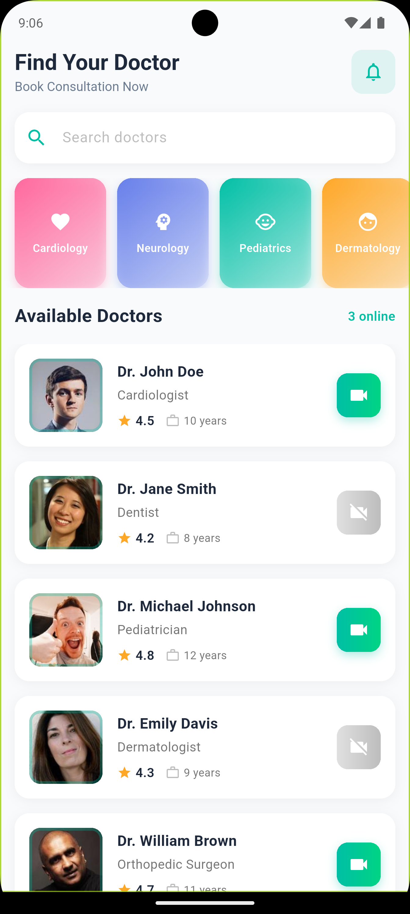
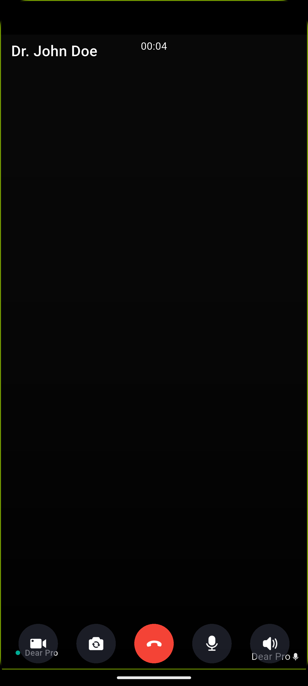
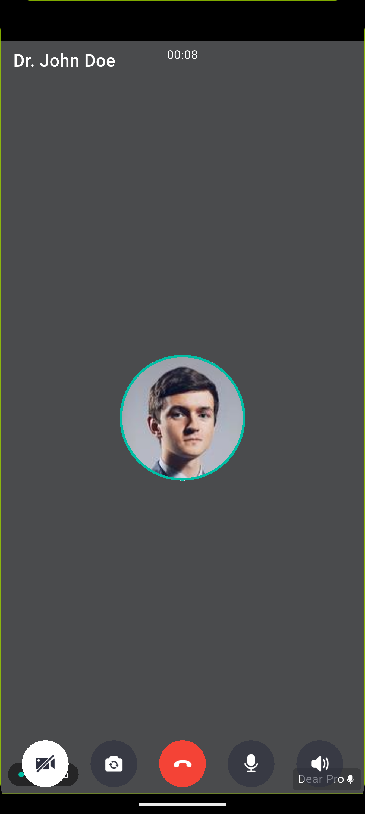

## Features

- 🏥 **Browse Doctors** - Explore a comprehensive list of doctors across different specialities
- 🔍 **Search Functionality** - Search for doctors by name or speciality
- ⭐ **Doctor Profiles** - View detailed doctor information including:
  - Professional photo
  - Speciality
  - Experience (in years)
  - Patient ratings
  - Availability status
- 📞 **Video Consultations** - Real-time one-on-one video calls with doctors using secure connections
- 🎨 **Modern UI/UX** - Beautiful Material 3 design with intuitive navigation
- 👨‍⚕️ **Multiple Specialities** - Doctors across various fields:
  - Cardiology
  - Neurology
  - Pediatrics
  - Dermatology
  - Orthopedic Surgery
  - And more...

## Project Structure

```
lib/
├── main.dart                 # App entry point and theme configuration
├── models/
│   └── doctor.dart          # Doctor data model
├── screens/
│   ├── home_screen.dart     # Home screen with doctor list
│   └── call_screen.dart     # Video call screen
└── utils/
    └── zego_config.dart     # Zego configuration
```

## Getting Started

### Prerequisites

- Flutter SDK 3.10.8 or higher
- Dart 3.10.8 or higher
- Zego AppID and AppSign (for video calling functionality)

### Installation

1. **Clone the repository**

   ```bash
   git clone https://github.com/yourusername/doctor_consultation.git
   cd doctor_consultation
   ```

2. **Get dependencies**

   ```bash

   ```

- Responsive layout that works on various screen sizes
- Custom rounded corners (16px) for modern appearance
- Smooth shadows and elevation for depth
- Inter font for consistent typography

## Data Model

### Doctor Model

```dart
Doctor {
  String id,           // Unique identifier
  String name,         // Doctor's full name
  String speciality,   // Medical speciality
  String imageUrl,     // Profile photo URL
  double rating,       // Patient rating (0-5)
  int experience,      // Years of experience
  bool isAvailable,    // Current availability status
}
```

- **Framework**: Flutter 3.10.8+
- **Language**: Dart
- **UI Design**: Material 3
- **Video Calling**: Zego UIKit
- **Architecture**: Modular, stateless widget-based design

## Project Highlights

### 🎨 **Premium UI/UX Design**

- Clean, modern interface following Material 3 design principles
- Cohesive color palette with teal (#00BFA5) as primary accent
- Smooth animations and thoughtful micro-interactions
- Fully responsive layout for various screen sizes
- Professional typography with Inter font family

### 📱 **Key Technical Achievements**

- **Real-time Video Calling**: Seamless one-on-one consultations with integrated Zego UIKit
- **Dynamic Doctor Listing**: Efficient list rendering with doctor availability indicators
- **Smart Search**: Multi-speciality doctor discovery with interactive filters
- **Custom UI Components**: Reusable, modular widget components
- **Theme Management**: Centralized Material 3 theming with custom styling

## Screenshots

Below are a few screenshots showcasing the app UI.

### Home Screen



### Call Screen




